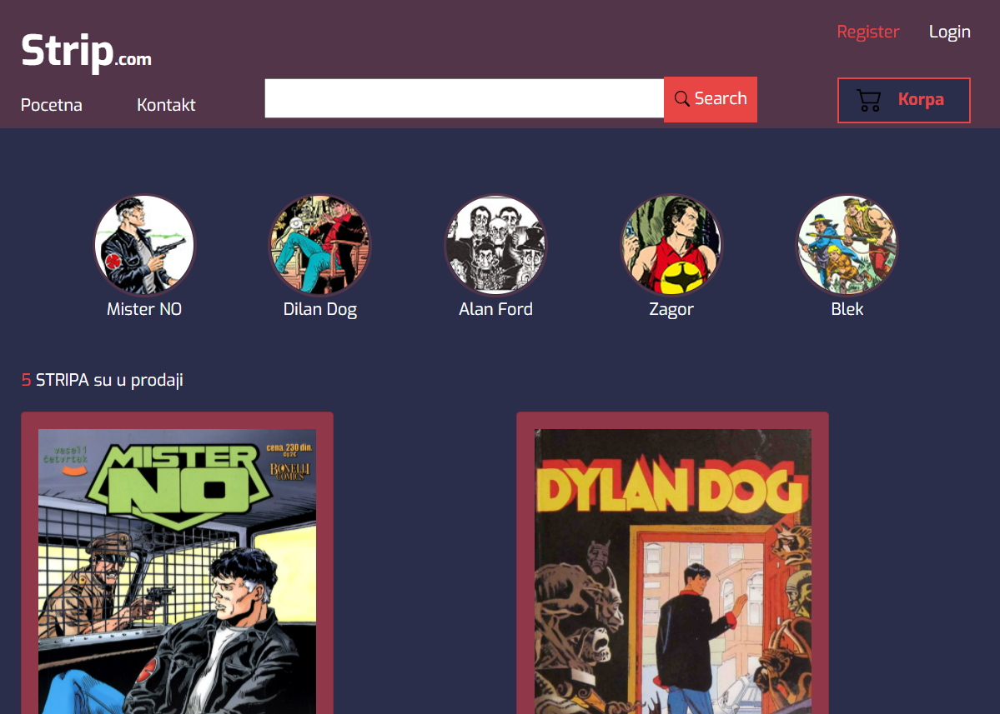

## Introduction

* This application is an online comic book store. The user has the opportunity to buy a comic that is in stock (only if the user is registered), and the administrator has insight into all events and transactions.

## Used Tehnology

* HTML & CSS (Responsive design)
* Bootstrap 
* C#
* Razor Pages
* Entity Framework
* Sql Server
* JQuery

## Installation

1. In appsettings.json change SQL server name.

```bash
  "ConnectionStrings": {
    "ApplicationDbContextConnection": 
    "Server=[YOURSQLSERVERNAME];Database=Stripovi.DB;Trusted_Connection=True;MultipleActiveResultSets=true"
  }
```
2. In Package Manager Console (make shure that default project is Stripovi.Web)

```bash
  update-database
```

3. Start Project

## Some highlights

* Click on test account if you don't want to register like new user.


* Available comics (main page)




* Main page of the administrator, feel free to try all the features

